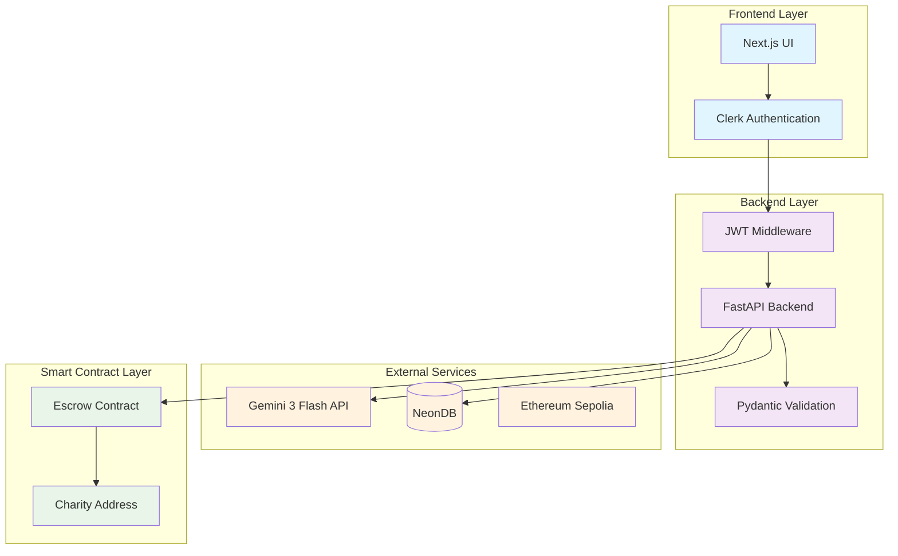

# Design Document: Skill-Stake Learning Platform

## Overview

The Skill-Stake Learning Platform is a blockchain-incentivized education system that combines AI-powered quiz generation with cryptocurrency staking to create accountability in learning. Users stake ETH before taking AI-generated quizzes based on their uploaded study materials. Achieving 70% or higher returns their stake, while lower scores automatically donate the stake to charity.

The system architecture emphasizes security through JWT authentication, reliability through structured data validation, and automation through smart contract settlement. The platform leverages modern technologies including Next.js for the frontend, FastAPI for the backend, Gemini 3 Flash for AI processing, NeonDB for data persistence, and Ethereum smart contracts for financial escrow.

## Architecture



The architecture follows a layered approach with clear separation of concerns:

- **Frontend Layer**: Handles user interface and authentication
- **Backend Layer**: Manages business logic, validation, and API orchestration
- **External Services**: Provides AI processing, data persistence, and blockchain connectivity
- **Smart Contract Layer**: Automates financial settlement and charity donations

## Components and Interfaces

### Frontend Components

**Authentication Component**
- Integrates with Clerk for secure user authentication
- Manages JWT token storage and refresh
- Provides login/logout functionality
- Handles authentication state across the application

**File Upload Component**
- Accepts PDF files with size and format validation
- Provides upload progress feedback
- Handles upload errors and retry logic
- Integrates with backend file processing endpoints

**Staking Interface**
- Connects to MetaMask or other Web3 wallets
- Displays current ETH balance and gas estimates
- Handles stake amount input and validation
- Provides transaction status feedback

**Quiz Interface**
- Displays AI-generated questions in a clean format
- Manages quiz state and user responses
- Provides immediate scoring and results
- Shows stake outcome and settlement status

### Backend API Endpoints

**Authentication Endpoints**
```
POST /auth/verify - Verify JWT token validity
GET /auth/user - Get authenticated user profile
```

**File Processing Endpoints**
```
POST /upload/pdf - Upload and process PDF files
GET /upload/status/{upload_id} - Check processing status
```

**Staking Endpoints**
```
POST /stake/create - Create new stake record
GET /stake/status/{stake_id} - Get stake status
POST /stake/settle - Trigger settlement after quiz completion
```

**Quiz Endpoints**
```
POST /quiz/generate - Generate quiz from processed PDF
GET /quiz/{quiz_id} - Retrieve quiz questions
POST /quiz/submit - Submit quiz answers and calculate score
```

### Data Models

**User Model**
```python
class User(BaseModel):
    user_id: str
    clerk_id: str
    email: str
    created_at: datetime
    updated_at: datetime
```

**Stake Model**
```python
class Stake(BaseModel):
    stake_id: str
    user_id: str
    amount_eth: Decimal
    transaction_hash: str
    status: StakeStatus  # PENDING, ACTIVE, SETTLED
    created_at: datetime
    settled_at: Optional[datetime]
    settlement_type: Optional[SettlementType]  # RETURNED, DONATED
```

**Quiz Model**
```python
class Quiz(BaseModel):
    quiz_id: str
    stake_id: str
    questions: List[QuizQuestion]
    user_answers: Optional[List[str]]
    score: Optional[int]
    completed_at: Optional[datetime]
    
class QuizQuestion(BaseModel):
    question_id: str
    question_text: str
    options: List[str]
    correct_answer: int  # Index of correct option
```

**PDF Processing Model**
```python
class PDFUpload(BaseModel):
    upload_id: str
    user_id: str
    filename: str
    file_size: int
    processing_status: ProcessingStatus  # UPLOADED, PROCESSING, COMPLETED, FAILED
    extracted_text: Optional[str]
    created_at: datetime
```

### AI Integration Layer

**Gemini API Integration**
- Processes uploaded PDF files using Gemini 3 Flash multimodal capabilities
- Extracts text content from complex PDF layouts including tables and figures
- Generates structured quiz data using JSON schema validation
- Handles API rate limiting and error recovery

**Quiz Generation Pipeline**
```python
class QuizGenerator:
    def process_pdf(self, pdf_file: bytes) -> str:
        # Extract text using Gemini 3 Flash
        
    def generate_quiz(self, text_content: str) -> QuizData:
        # Generate 10 questions with structured JSON output
        
    def validate_quiz(self, quiz_data: dict) -> QuizData:
        # Validate against Pydantic schema
```

### Blockchain Integration

**Smart Contract Interface**
```solidity
contract SkillStakeEscrow {
    struct Stake {
        address user;
        uint256 amount;
        bool settled;
        uint256 timestamp;
    }
    
    function createStake() external payable returns (uint256 stakeId);
    function settleStake(uint256 stakeId, bool passed) external;
    function emergencyWithdraw(uint256 stakeId) external;
}
```

**Web3 Integration Layer**
- Manages Ethereum wallet connections
- Handles transaction signing and broadcasting
- Monitors transaction confirmations
- Provides gas estimation and optimization

## Data Models

### Database Schema

**Users Table**
```sql
CREATE TABLE users (
    user_id UUID PRIMARY KEY DEFAULT gen_random_uuid(),
    clerk_id VARCHAR(255) UNIQUE NOT NULL,
    email VARCHAR(255) NOT NULL,
    created_at TIMESTAMP DEFAULT NOW(),
    updated_at TIMESTAMP DEFAULT NOW()
);
```

**Stakes Table**
```sql
CREATE TABLE stakes (
    stake_id UUID PRIMARY KEY DEFAULT gen_random_uuid(),
    user_id UUID REFERENCES users(user_id),
    amount_eth DECIMAL(18,8) NOT NULL,
    transaction_hash VARCHAR(66) NOT NULL,
    contract_stake_id BIGINT,
    status VARCHAR(20) DEFAULT 'PENDING',
    created_at TIMESTAMP DEFAULT NOW(),
    settled_at TIMESTAMP,
    settlement_type VARCHAR(20)
);
```

**Quizzes Table**
```sql
CREATE TABLE quizzes (
    quiz_id UUID PRIMARY KEY DEFAULT gen_random_uuid(),
    stake_id UUID REFERENCES stakes(stake_id),
    questions JSONB NOT NULL,
    user_answers JSONB,
    score INTEGER,
    completed_at TIMESTAMP,
    created_at TIMESTAMP DEFAULT NOW()
);
```

**PDF Uploads Table**
```sql
CREATE TABLE pdf_uploads (
    upload_id UUID PRIMARY KEY DEFAULT gen_random_uuid(),
    user_id UUID REFERENCES users(user_id),
    filename VARCHAR(255) NOT NULL,
    file_size INTEGER NOT NULL,
    processing_status VARCHAR(20) DEFAULT 'UPLOADED',
    extracted_text TEXT,
    created_at TIMESTAMP DEFAULT NOW()
);
```

### Data Validation Schemas

**Quiz Generation Schema**
```python
class QuizGenerationRequest(BaseModel):
    upload_id: str
    stake_id: str
    
class QuizQuestion(BaseModel):
    question_text: str = Field(min_length=10, max_length=500)
    options: List[str] = Field(min_items=4, max_items=4)
    correct_answer: int = Field(ge=0, le=3)
    
class GeneratedQuiz(BaseModel):
    questions: List[QuizQuestion] = Field(min_items=10, max_items=10)
    source_material: str
    generation_timestamp: datetime
```

**Staking Schema**
```python
class StakeCreationRequest(BaseModel):
    amount_eth: Decimal = Field(gt=0, decimal_places=8)
    upload_id: str
    
class StakeSettlementRequest(BaseModel):
    stake_id: str
    quiz_score: int = Field(ge=0, le=100)
    quiz_id: str
```

## Correctness Properties

*A property is a characteristic or behavior that should hold true across all valid executions of a system—essentially, a formal statement about what the system should do. Properties serve as the bridge between human-readable specifications and machine-verifiable correctness guarantees.*

### Property 1: Authentication and Authorization Consistency
*For any* user request to the platform, authentication should be required and users should only access their own data when properly authenticated.
**Validates: Requirements 1.1, 1.2, 1.3, 1.4**

### Property 2: PDF Processing Round Trip
*For any* valid PDF file uploaded by an authenticated user, the system should successfully extract text content and generate exactly 10 quiz questions in valid JSON format.
**Validates: Requirements 2.1, 2.2, 2.3, 2.5**

### Property 3: Staking Workflow Integrity
*For any* valid stake creation request, the system should successfully record the stake in the database, lock funds in the smart contract, and prevent quiz access until confirmation.
**Validates: Requirements 3.1, 3.2, 3.3, 3.4**

### Property 4: Quiz Generation Consistency
*For any* processed PDF content, the AI engine should generate quiz data that passes Pydantic validation and maintains proper database relationships.
**Validates: Requirements 4.1, 4.2, 4.3, 4.4**

### Property 5: Scoring Calculation Accuracy
*For any* submitted quiz answers, the scoring system should calculate the percentage correctly based on the number of correct answers out of 10 questions.
**Validates: Requirements 5.2, 5.4**

### Property 6: Settlement Logic Correctness
*For any* completed quiz, if the score is 70% or higher the stake should be returned to the user, otherwise it should be donated to charity, and the database should reflect the settlement.
**Validates: Requirements 6.1, 6.2, 6.3**

### Property 7: Data Integrity and Consistency
*For any* database operation involving financial records, ACID compliance should be maintained and all referential integrity constraints should be preserved.
**Validates: Requirements 7.1, 7.3, 7.4**

### Property 8: API Input Validation
*For any* API request, all inputs should be validated using Pydantic models before processing, and invalid inputs should be rejected with appropriate error messages.
**Validates: Requirements 8.1, 8.2, 8.3, 8.4**

### Property 9: Error Handling Consistency
*For any* system operation that fails, appropriate error messages should be returned and error states should be logged for debugging and recovery.
**Validates: Requirements 2.4, 6.4, 8.2**

## Error Handling

### Authentication Errors
- **Invalid JWT Token**: Return 401 Unauthorized with clear error message
- **Expired Token**: Return 401 Unauthorized and trigger token refresh flow
- **Missing Token**: Return 401 Unauthorized and redirect to login

### File Processing Errors
- **Invalid File Format**: Return 400 Bad Request with supported format list
- **File Too Large**: Return 413 Payload Too Large with size limits
- **AI Processing Failure**: Return 500 Internal Server Error and allow retry
- **Quota Exceeded**: Return 429 Too Many Requests with retry timing

### Blockchain Errors
- **Insufficient Funds**: Return 400 Bad Request with balance information
- **Transaction Failed**: Return 500 Internal Server Error with transaction hash
- **Network Congestion**: Return 503 Service Unavailable with retry suggestion
- **Contract Interaction Failed**: Log error and provide manual resolution path

### Database Errors
- **Connection Timeout**: Implement retry logic with exponential backoff
- **Constraint Violation**: Return 400 Bad Request with specific constraint details
- **Transaction Rollback**: Ensure all related operations are properly rolled back
- **Data Corruption**: Implement data validation and recovery procedures

### Recovery Strategies
- **Automatic Retry**: Implement for transient failures (network, rate limits)
- **Manual Intervention**: Provide admin tools for stuck transactions
- **Data Backup**: Regular snapshots of critical financial data
- **Monitoring**: Real-time alerts for system failures and anomalies

## Testing Strategy

### Dual Testing Approach

The testing strategy employs both unit testing and property-based testing to ensure comprehensive coverage:

- **Unit Tests**: Verify specific examples, edge cases, and error conditions
- **Property Tests**: Verify universal properties across all inputs using randomized test data
- **Integration Tests**: Verify end-to-end workflows across system boundaries

### Property-Based Testing Configuration

**Testing Framework**: Use `hypothesis` for Python property-based testing with FastAPI
**Test Configuration**: Minimum 100 iterations per property test to ensure statistical confidence
**Test Tagging**: Each property test must reference its design document property using the format:
```python
# Feature: skill-stake-learning, Property 1: Authentication and Authorization Consistency
```

### Unit Testing Focus Areas

**Authentication and Security**
- Test JWT token validation with various token states
- Test user data isolation with multiple user scenarios
- Test rate limiting and security headers

**File Processing**
- Test PDF upload with various file formats and sizes
- Test AI API integration with mock responses
- Test quiz generation with edge cases (empty PDFs, corrupted files)

**Blockchain Integration**
- Test smart contract interactions with test networks
- Test transaction failure scenarios and recovery
- Test gas estimation and optimization

**Database Operations**
- Test ACID compliance with concurrent operations
- Test referential integrity with complex data relationships
- Test backup and recovery procedures

### Property Testing Implementation

Each correctness property will be implemented as a property-based test:

**Property 1 Test**: Generate random user requests and verify authentication requirements
**Property 2 Test**: Generate random valid PDFs and verify complete processing pipeline
**Property 3 Test**: Generate random stake amounts and verify complete staking workflow
**Property 4 Test**: Generate random PDF content and verify quiz generation consistency
**Property 5 Test**: Generate random quiz answers and verify scoring accuracy
**Property 6 Test**: Generate random quiz scores and verify settlement logic
**Property 7 Test**: Generate random database operations and verify ACID compliance
**Property 8 Test**: Generate random API inputs and verify validation behavior
**Property 9 Test**: Generate random failure scenarios and verify error handling

### Integration Testing

**End-to-End Workflows**
- Complete user journey from registration to stake settlement
- Cross-service communication testing (Frontend ↔ Backend ↔ AI ↔ Blockchain)
- Performance testing under realistic load conditions

**External Service Integration**
- Gemini API integration with various PDF types and content
- Ethereum testnet integration with various network conditions
- NeonDB integration with various query patterns and loads

### Test Data Management

**Synthetic Data Generation**: Use property-based testing to generate realistic test data
**Test Isolation**: Each test should create and clean up its own data
**Sensitive Data Handling**: Use mock data for financial and personal information
**Performance Benchmarks**: Establish baseline performance metrics for regression testing